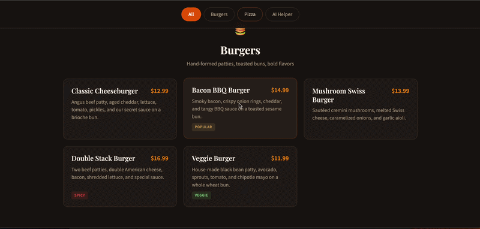

# Menu AI




A small customer-facing restaurant menu web app for Grill & Slice. It shows burger and pizza menu items and includes an AI Helper tab that answers menu questions through a local Ollama model.

## Features

- Responsive burger and pizza menu
- Category filtering
- Customer AI helper powered by Ollama
- Local static server script for Windows PowerShell
- SQL migration and seed files for menu item storage

## Requirements

- Windows PowerShell
- Ollama running locally on port `11434`
- The `llama3.2:latest` model installed in Ollama

Install the model:

```powershell
ollama pull llama3.2
```

Start Ollama if it is not already running:

```powershell
ollama serve
```

## Run The App

From the project folder:

```powershell
.\start-server.ps1
```

Open the app in your browser:

```text
http://localhost:8000/
```

Use the `AI Helper` tab to ask customer questions such as menu recommendations, vegetarian options, or price comparisons.

## Notes

Do not open `index.html` directly as a `file://` page when using the AI helper. Ollama accepts requests from `http://localhost:8000`, so the app should be served with `start-server.ps1`.

The Ollama model is configured in `menu.js`:

```js
const OLLAMA_MODEL = "llama3.2:latest";
```

## Database Files

The `database/` folder includes:

- `migrations/001_create_menu_items.sql`
- `seeds/menu_items.sql`

These files define and populate a simple `menu_items` table for environments that want to store menu data in a database.
